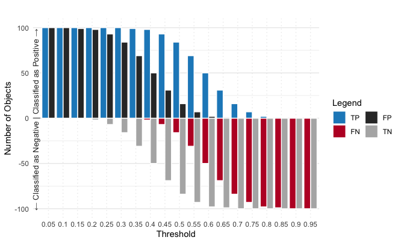
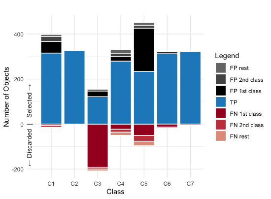
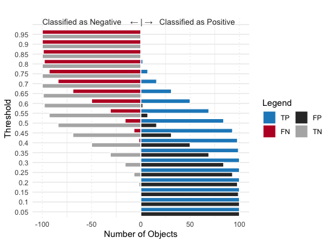
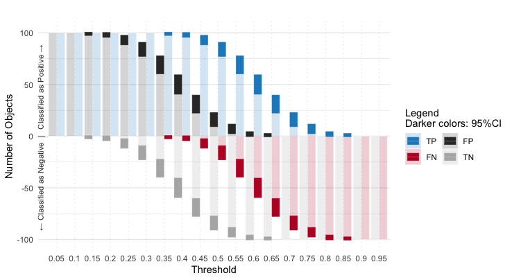
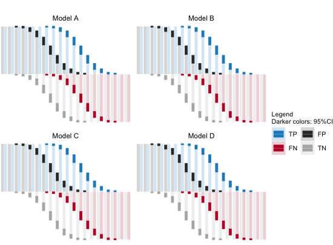

# Classee - Visualization of classification errors

Simplified visualization for binary and multiclass classification.



```r
# Check the data format
data <- classee_sample_binary()

# A tibble: 76 x 4
   threshold output nitem class
   <chr>     <chr>  <dbl> <chr>
 1 0.05      TN         0 C0   
 2 0.1       TN         0 C0   
 3 0.15      TN        -1 C0   
 4 0.2       TN        -2 C0   
 5 0.25      TN        -7 C0   

# Make the plot above
classee_binary(data)
```



```r
# Check the data format
data_multi <- classee_sample_multi()

            Actual 1 Actual 2 Actual 3 Actual 4 Actual 5 Actual 6 Actual 7
Predicted 1      316        0        8       23       51        0        1
Predicted 2        0      327        0        0        0        0        0
Predicted 3        0        0      122        6       25        4        0
Predicted 4        7        3        8      280       20       13        0
Predicted 5        7        0      192       13      234        0        5
Predicted 6        0        0        0        8        0      313        0
Predicted 7        0        0        0        0        0        0      324

# Make the plot above
classee_multiclass(data_multi)
```

# Extra Options



```r
# Make the plot above
classee_binary(data, vertical=true)
```



```r
# Make the plot above
classee_binary_var(data)
```



```r
# Check the data format
data_facet <- classee_sample_binary_facet()

# A tibble: 304 x 5
   threshold output nitem class facet  
   <chr>     <chr>  <dbl> <chr> <chr>  
 1 0.05      TN         0 C0    Model D
 2 0.1       TN         0 C0    Model D
 3 0.15      TN        -1 C0    Model D
 4 0.2       TN        -2 C0    Model D
 5 0.25      TN        -7 C0    Model D

# Make the plot above
classee_binary_var_facet(data_facet)

# Version without variance
classee_binary_facet(data_facet)
```

# Citation

Supporting End-User Understanding of Classification Errors: Visualization and Usability Issues.
E. Beauxis-Aussalet, J. van Doorn, L. Hardman.
Journal of Interaction Science, JoIS, 2019.
https://ir.cwi.nl/pub/28813
